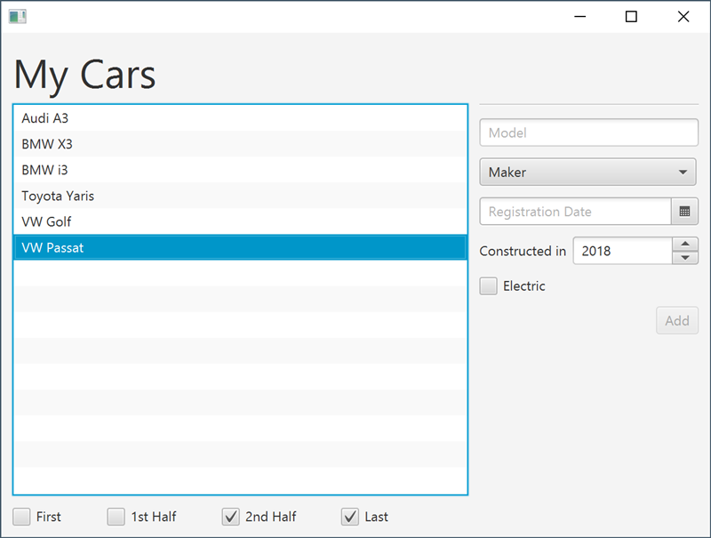

# My Cars

In dieser Übung sollen Sie die Benutzerfreundlichkeit der dargestellten Applikation verbessern.

## Task 1: Clear Form

Implementieren Sie im `MyCarsController` die Methode `clearCarForm()`. Diese soll alle Eingabefelder (mit Ausnahme der `ListView`) auf den oben dargestellten Ausgangszustand zurücksetzen.

Verwenden Sie die Methode, um dem Benutzer, nach dem Hinzufügen eines Autos, wieder ein leeres Formular zur Verfügung zustellen.

## Task 2: Filter Events

Stellen Sie sicher, dass ein Klick auf die Checkboxen zu keinem Programmabsturz führt. Implementieren Sie hierfür die Methode `filterCheckBoxEvents()`, die jedes `InputEvent` der Checkboxen konsumiert.

## Task 3: Bind Years

Stellen Sie sicher, dass der *Add*-Button deaktiviert ist, wenn das Registrierungsjahr vor dem Herstellungsjahr liegt.

**Tipps:**

- Erzeugen Sie mithilfe von [`Bindings.selectInteger()`](https://openjfx.io/javadoc/15/javafx.base/javafx/beans/binding/Bindings.html#selectInteger(javafx.beans.value.ObservableValue,java.lang.String...)) ein `IntegerBinding` für das Registrierungsjahr und speichern Sie dieses in der Variable `registrationYear`.
- Erzeugen Sie ebenfalls mithilfe von `Bindings.selectInteger()` ein `IntegerBinding` für das Herstellungsjahr und speichern Sie dieses in der Variable `creationYear`.
- Erstellen Sie mit `registrationYear` und `creationYear` eine weitere Bedingung für das `disableProperty` des *Add*-Buttons.

